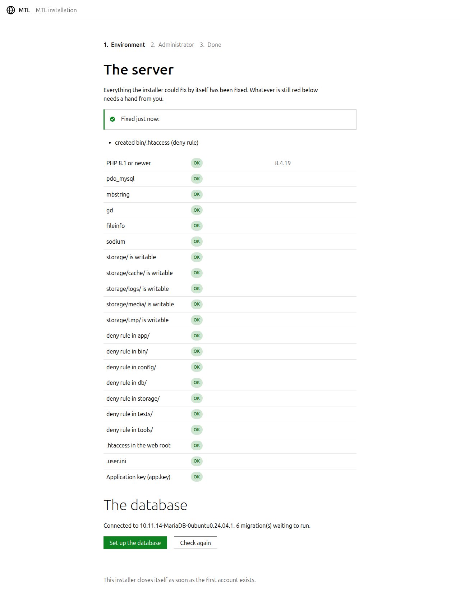
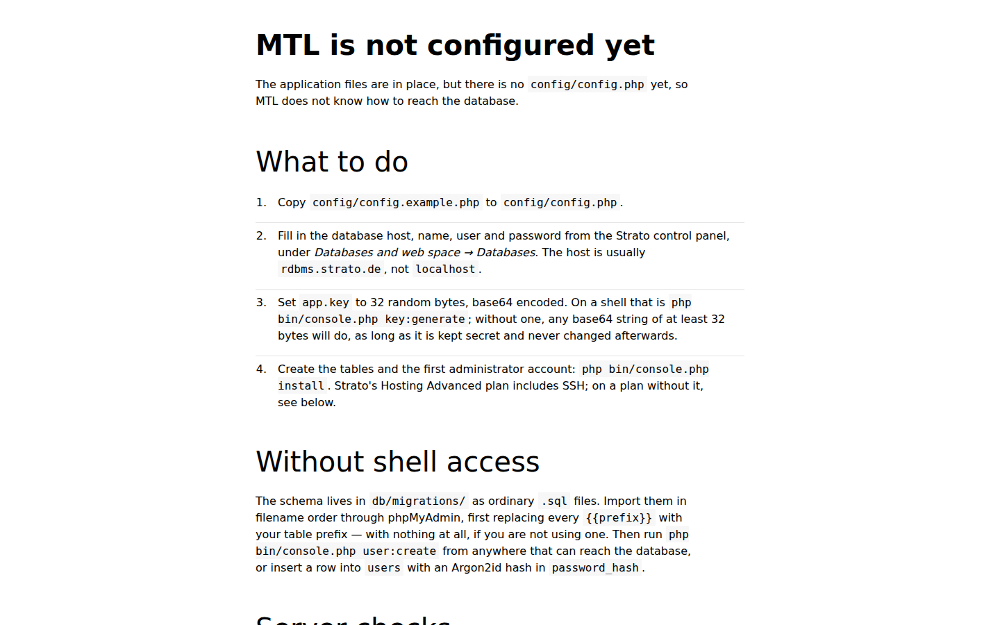
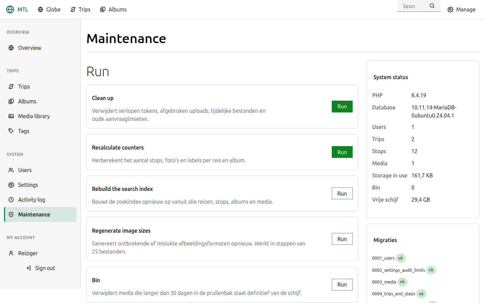

# MTL op Strato zetten

Voor **Hosting Advanced** (of nieuwer) met een eigen domein. Voor
`https://mtl.r010.space`, maar elk domein of subdomein werkt.

De korte versie: uploaden, database aankoppelen, `install` draaien, HTTPS
aanzetten. Reken op een half uur, en op wachten tot DNS is bijgetrokken.

---

## 1. Voordat je begint

Zet dit klaar uit het Strato **Kundenlogin**:

| | Waar |
| --- | --- |
| FTP-gegevens | *Hosting → FTP* |
| Databasegegevens | *Datenbanken → MySQL-Datenbank* |
| PHP-versie op 8.1+ | *Hosting → PHP-Version* |

Zet de PHP-versie **eerst**. Strato start nieuwe accounts soms op een oudere
versie, en MTL weigert dan te starten met een duidelijke melding in plaats van
een half werkende site.

Maak een database aan en noteer host, naam, gebruiker en wachtwoord. De host is
op Strato meestal `rdbms.strato.de` en niet `localhost`; die van jou staat in
het Kundenlogin.

## 2. Bestanden uploaden

De repository-root wordt de webroot. Bij Strato is dat de map die je FTP-account
opent — vaak direct `/`, soms `/htdocs` of een map per domein. Zet de **inhoud**
van de repository daarin, dus `index.php` komt náást `app/` te staan, niet in
een submap `mtl/`.

```
/  (webroot)
├── index.php
├── .htaccess
├── .user.ini
├── app/
├── assets/
├── config/
├── db/
├── bin/
└── storage/
```

Wat je **niet** hoeft te uploaden — het draait nooit op de server:

```
tools/          Sass-bron en de globe-generator
tests/          de testsuite
android/        de app-schil
.git/           de geschiedenis
```

Ze doen geen kwaad als ze er wel staan: `.htaccess` blokkeert ze. Maar
weglaten is sneller en scheelt ruimte.

> **Let op de verborgen bestanden.** `.htaccess` en `.user.ini` beginnen met een
> punt en veel FTP-programma's tonen die standaard niet. Zonder `.htaccess`
> krijg je op elke pagina behalve de voorpagina een 404; zonder `.user.ini`
> lopen uploads van grote foto's vast. Zet "verborgen bestanden tonen" aan en
> controleer of ze er staan.

### Schrijfrechten

`storage/` moet beschrijfbaar zijn. Bij Strato is dat meestal al zo; anders via
je FTP-programma:

```
storage/            755
storage/media/      755
storage/cache/      755
storage/logs/       755
storage/tmp/        755
```

## 3. Instellen

Eén bestand invullen, en de rest gebeurt in de browser. Maak
`config/config.php`, met `config/config.example.php` als voorbeeld:

```php
<?php

return [
    'app' => [
        'url'   => 'https://mtl.r010.space',
        'env'   => 'production',
        'debug' => false,
        'key'   => 'PLAK-HIER-EEN-SLEUTEL',
    ],
    'database' => [
        'host'     => 'rdbms.strato.de',
        'name'     => 'dbs1234567',
        'user'     => 'dbu1234567',
        'password' => 'het-wachtwoord-uit-het-kundenlogin',
    ],
];
```

De `key` versleutelt geheimen in de database — TOTP-secrets bijvoorbeeld.
Genereer er een met `php bin/console.php key:generate`, of, als je nergens PHP
op de opdrachtregel hebt, met 32 willekeurige bytes in base64:

```bash
openssl rand -base64 32
```

Laat je de sleutel leeg, dan genereert de installer er zo meteen zelf een en
zet hem in het bestand — mits `config/config.php` beschrijfbaar is.

**Bewaar die sleutel.** Raak je hem kwijt, dan is alles wat ermee versleuteld is
onleesbaar, en moet iedereen zijn tweefactor opnieuw instellen.

### De webinstaller

Open daarna gewoon je domein. Elke URL leidt naar `/install`, en die wizard
doet wat een installateur hoort te doen:

1. **Omgeving** — controleert PHP-versie, extensies, schrijfrechten en de
   beveiligingsbestanden, en herstelt zelf wat te herstellen valt: ontbrekende
   `storage/`-mappen worden aangemaakt, ontbrekende weigerregels
   (`app/.htaccess` enzovoort) teruggezet, een lege `app.key` gegenereerd.
   Wat overblijft is precies wat alleen jij kunt oplossen, met de reden erbij.
2. **Database** — maakt verbinding met de gegevens uit `config/config.php`
   (met de échte foutmelding als dat niet lukt) en richt het schema in.
3. **Beheerder** — sitenaam plus het eerste account. Je bent daarna meteen
   aangemeld.



Zodra het eerste account bestaat, vergrendelt de installer zichzelf: `/install`
geeft vanaf dat moment een 404, alsof de route nooit bestaan heeft. (Bewust
opnieuw installeren kan alleen door én alle accounts én
`storage/cache/installed.lock` te verwijderen.)

### Liever de opdrachtregel

Hetzelfde kan via SSH: `php bin/console.php install` stelt dezelfde vragen en
doet hetzelfde werk, en schrijft desgewenst ook `config/config.php` voor je.

> **De `php` op Strato's shell is de CGI-variant.** Dat werkt gewoon, maar hij
> drukt vóór de uitvoer een blokje HTTP-headers af. Stoort dat, gebruik dan
> `php -q bin/console.php …`.

Zolang `config/config.php` óók nog ontbreekt, toont elke URL eerst een statische
setup-pagina met dezelfde servercontroles:



## 4. HTTPS

Zet in het Kundenlogin onder *Hosting → SSL* het gratis Let's
Encrypt-certificaat aan en wacht tot het actief is.

`.htaccess` stuurt zelf al alles door naar HTTPS, en houdt daarbij rekening met
de load balancer waar Strato achter staat: hij kijkt naar
`X-Forwarded-Proto`, want `%{HTTPS}` staat bij de PHP-applicatie altijd op
`off`. Je hoeft daar niets voor te wijzigen.

Controleer daarna:

* `https://jouwdomein` laadt de wereldbol
* `http://jouwdomein` gaat door naar `https://`
* `https://jouwdomein/app/bootstrap.php` geeft **404**, geen broncode
* `https://jouwdomein/config/config.php` geeft **404**
* `https://jouwdomein/storage/logs/` geeft **404**

Die laatste drie zijn het belangrijkst. Krijg je in plaats van een 404 iets
anders te zien, dan wordt `.htaccess` niet gelezen — controleer of het bestand
er staat en of `AllowOverride` aanstaat (bij Strato standaard wel).

## 5. Cron

Optioneel maar aan te raden. In het Kundenlogin onder *Hosting → Cron-Jobs*,
één keer per dag:

```
php -q /pad/naar/webroot/bin/console.php maintenance
```

(De `-q` houdt de HTTP-headers van Strato's CGI-binary uit de cron-mail.)

Dat ruimt op: verlopen aanmeldpogingen, verlopen tokens, afgebroken uploads,
tijdelijke bestanden, oude logboeken, en het telt de aantallen per reis opnieuw
na.

Zonder cron gebeurt het goedkope deel vanzelf tijdens gewoon verkeer. Er gaat
dus niets stuk als je dit overslaat; de database wordt alleen langzaam groter
dan nodig.

## 6. Nakijken

Meld je aan op `https://jouwdomein/login` en loop dit af:

* **Instellingen → Algemeen** — titel, ondertitel, taal, tijdzone
* **Instellingen → Media** — laat *GPS verwijderen* aan staan als je niet wilt
  dat foto's hun opnamecoördinaten meedragen naar iedereen die ze downloadt
* **Instellingen → Wereldbol** — `high` geeft scherpere kustlijnen en een
  grotere download; `low` is voor de meeste reizen genoeg
* **Beheer → Onderhoud** — hier staat of GD, sodium en de schrijfrechten in orde
  zijn:



Zet dan een testreis met een foto op en controleer of de miniaturen verschijnen.
Blijft een foto leeg, kijk dan bij *Onderhoud* of GD er is; zonder die extensie
worden er geen varianten gemaakt.

## Bijwerken

```bash
git pull
php bin/console.php migrate
php bin/console.php optimize
```

Via FTP: alles behalve `config/`, `storage/` en `.user.ini` overschrijven, en
daarna `migrate` draaien. Voegt een nieuwe versie geen migratie toe, dan is
overschrijven genoeg — `migrate:status` laat zien of er nog iets openstaat.

`optimize` bouwt de classmap en het asset-manifest opnieuw. Sla het over en het
werkt nog steeds, alleen iets langzamer, en assets krijgen hun versie dan uit de
wijzigingsdatum in plaats van uit de inhoud — waardoor twee servers verschillende
URL's kunnen geven voor hetzelfde bestand.

Verandert er iets aan de markdown-renderer, dan blijft eerder opgeslagen HTML
staan zoals hij was. Dit haalt die bij:

```bash
php bin/console.php content:rerender --dry-run   # kijken wat er zou veranderen
php bin/console.php content:rerender
```

## Reservekopie

Drie dingen, en je hebt ze alle drie nodig:

```bash
# 1. De database
mysqldump -h rdbms.strato.de -u dbu1234567 -p dbs1234567 > mtl-$(date +%F).sql

# 2. De media
tar czf mtl-media-$(date +%F).tar.gz storage/media/

# 3. De configuratie — bevat de sleutel waarmee alles versleuteld is
cp config/config.php mtl-config-$(date +%F).php
```

Zonder nummer 3 kun je nummer 1 wel terugzetten, maar zijn de versleutelde
velden erin onleesbaar.

## Als er iets niet werkt

**Elke pagina behalve de voorpagina geeft 404.**
`.htaccess` ontbreekt of `mod_rewrite` staat uit. Controleer of het bestand
geüpload is (het begint met een punt) en of *Hosting → Apache* rewrites
toestaat.

**Overal 500.**
Meestal `php_value` in een `.htaccess` van jezelf: onder FastCGI geeft dat een
500. PHP-instellingen horen in `.user.ini`. Anders staat de echte melding in
`storage/logs/`.

**"MTL requires PHP 8.1 or newer."**
De PHP-versie staat nog op de oude in *Hosting → PHP-Version*. Let op dat je de
versie voor het juiste domein zet als je er meerdere hebt.

**"Database connection failed".**
Host is bij Strato bijna nooit `localhost`. Neem de waarde uit het Kundenlogin
over, meestal `rdbms.strato.de`.

**Foto's uploaden lukt niet, of stopt halverwege.**
`.user.ini` staat er niet, of hij is nog niet actief: PHP leest dat bestand met
een cache van vijf minuten. Wacht even en probeer opnieuw.

**Een gewijzigde stylesheet of een gewijzigd script komt niet door.**
Draai `php bin/console.php optimize`. De versie van een asset zit in het pad
(`/assets/v1a2b3c4d/…`), en dat segment verandert pas als het manifest opnieuw
is gebouwd of de bestanden een nieuwe wijzigingsdatum hebben.

**De wereldbol blijft leeg.**
Kijk in de console van de browser. Ontbreekt `assets/data/globe-land-110m.png`,
dan is de map `assets/data/` niet meegeüpload — sommige FTP-programma's slaan
mappen zonder tekstbestanden over.

**De site blijft naar /install verwijzen terwijl alles al is ingericht.**
De vergrendeling kon niet worden geschreven: controleer of `storage/cache/`
beschrijfbaar is. De installer herstelt dat normaliter zelf; lukt ook dat niet,
dan zijn de rechten op `storage/` het probleem.

**`bin/console.php` zegt "can only be run from the command line" op de shell.**
Een oudere versie keurde alles af wat niet de CLI-binary was, en op Strato's
shell ís `php` de CGI-binary. Werk de bestanden bij: de huidige versie kijkt
naar wat een webverzoek werkelijk kenmerkt en werkt met beide binaries.

**Aanmelden lukt niet meer en er komt geen foutmelding.**
Waarschijnlijk de rem op aanmeldpogingen na te veel probeersels. Wacht een
kwartier, of leeg de tabel `rate_limits`.
