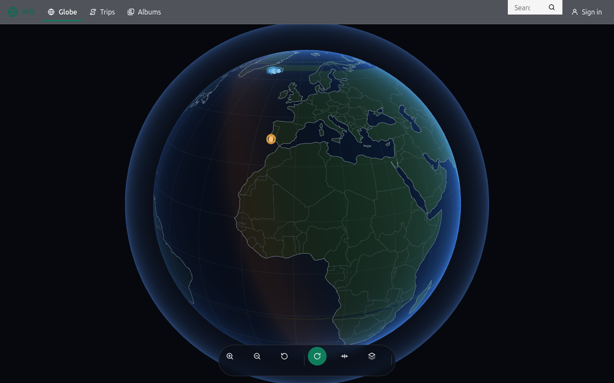
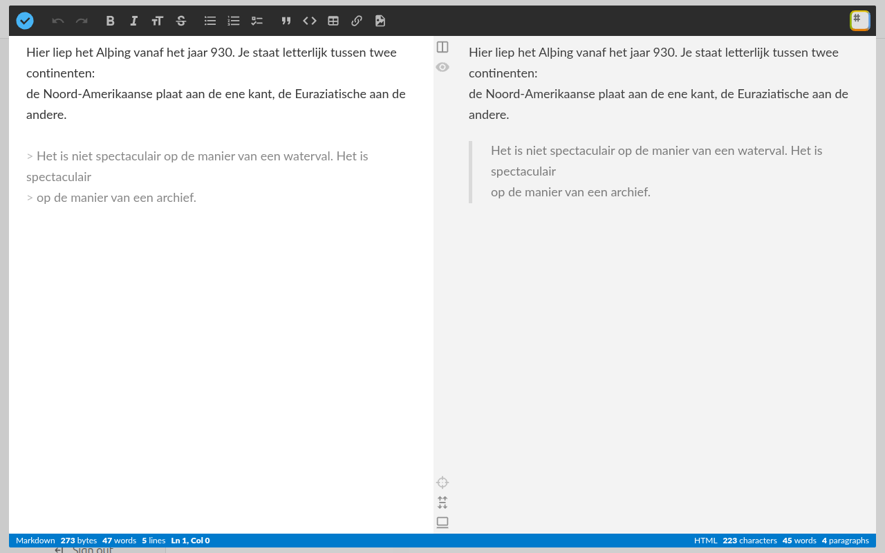
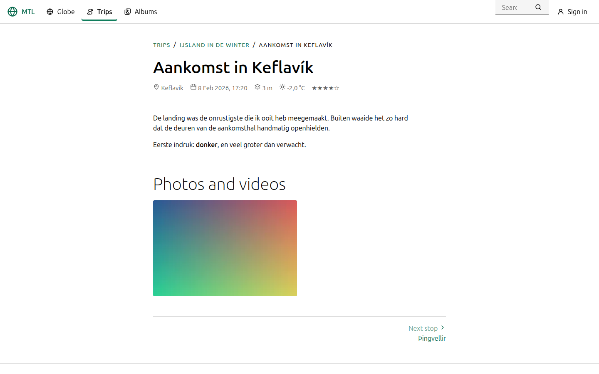
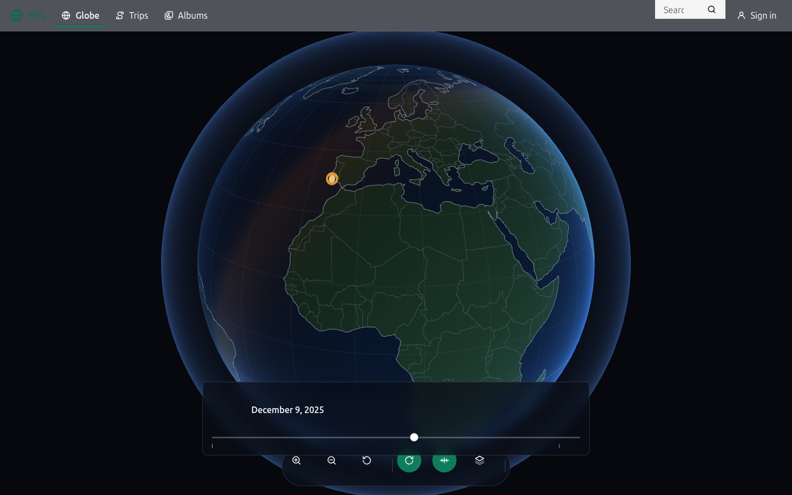
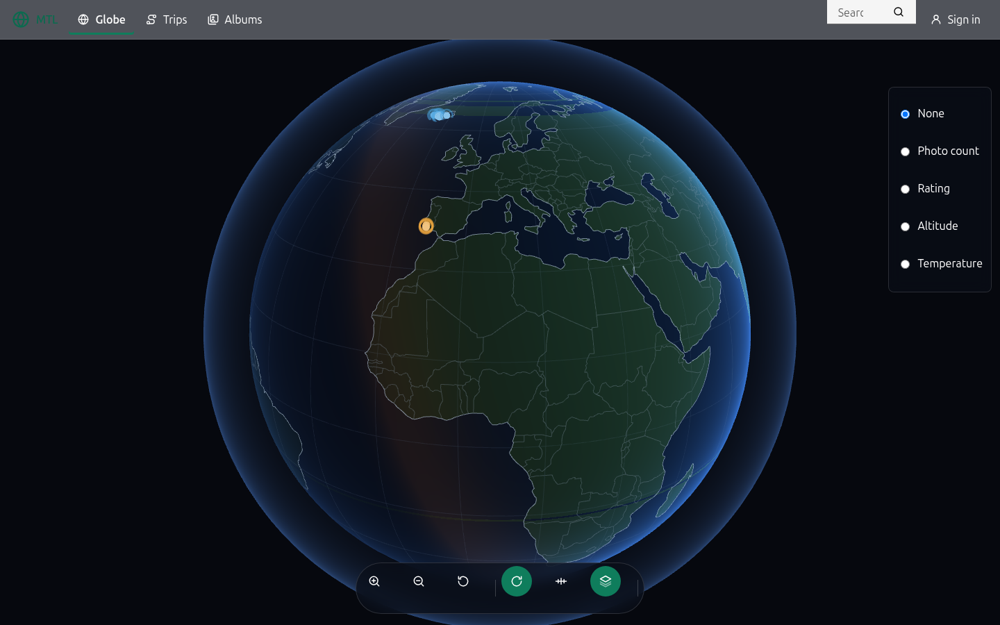
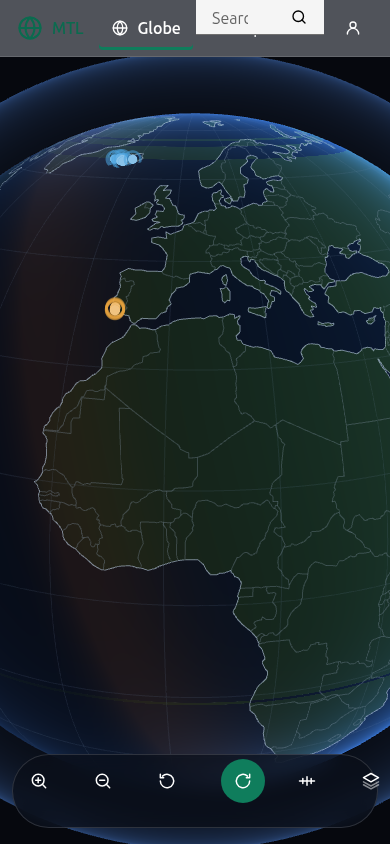
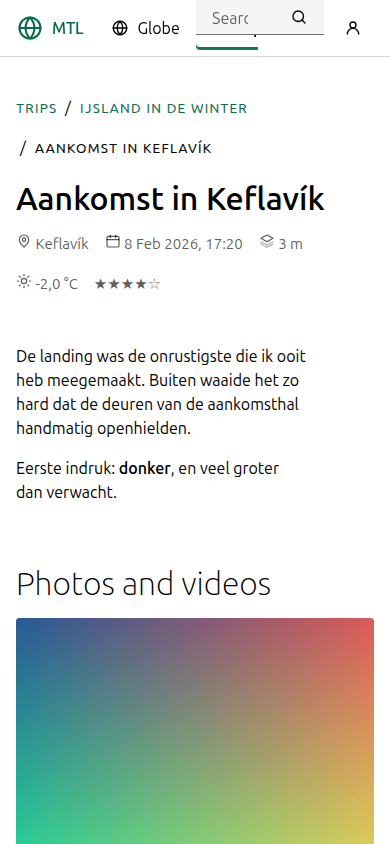
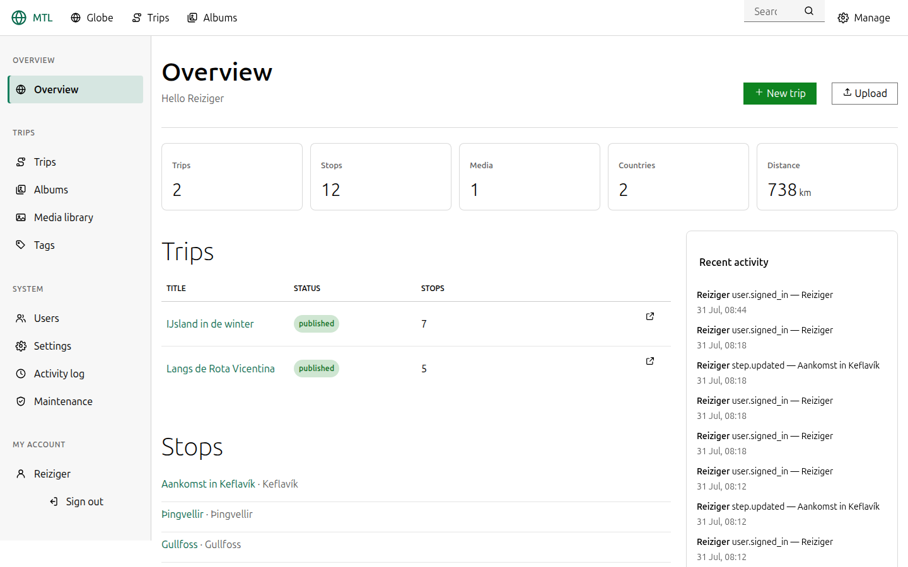
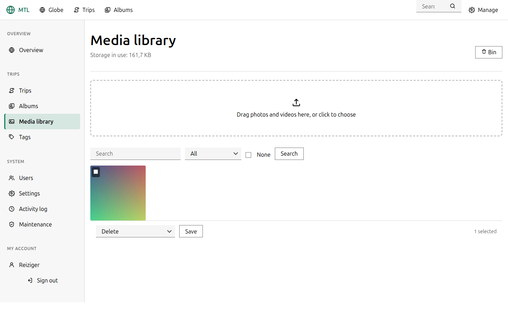

# MTL — Minimalistic Travel Log

Een eigen, self-hosted reisdagboek. Losjes gebaseerd op Polarsteps, maar
kleiner, en gebouwd om te draaien op gewone webhosting: PHP en MariaDB, geen
Node op de server, geen Composer, geen Docker.

Foto's en video's uploaden, in albums zetten, per stop een titel en een
reisverslag schrijven, en het geheel terugzien op een draaibare wereldbol.



```
  Publiek                            Beheer
  ───────────────────────────        ─────────────────────────────
  /                  wereldbol       /admin              overzicht
  /trips             reizen          /admin/trips        reizen
  /trips/{reis}      één reis        /admin/steps/{n}    stop bewerken
  /trips/{reis}/{stop}               /admin/media        mediabibliotheek
  /albums            albums          /admin/albums       albums
  /search            zoeken          /admin/users        gebruikers
  /feed.xml          RSS             /admin/settings     instellingen
```

## Wat het is

* **Eén PHP-applicatie zonder framework.** Router, database-laag, views,
  validatie en migraties horen bij de code. Dat is een keuze voor het doel: op
  Strato is er geen Composer en geen build-stap, dus elke afhankelijkheid is
  iets dat ooit stukgaat op een moment dat je er niet bij kunt.
* **Markdown is de bron.** Verslagen worden als markdown bewaard en
  server-side gerenderd door een eigen CommonMark 0.31 + GFM-implementatie
  (met één bewuste afwijking: een nieuwe regel is een nieuwe regel). De editor
  is [StackEdit](https://stackedit.io), als eigen build meegeleverd in
  `assets/stackedit/` en schermvullend geopend vanaf het formulier — met de
  fotobibliotheek van de site achter de afbeeldingsknop.
* **Een wereldbol in WebGL, zonder bibliotheken.** Land uit een
  equirectangulaire maskerafbeelding, kustlijnen als gequantiseerde vectoren,
  routes als great-circle-linten, een dag-en-nachtgrens uit de zonnestand, en
  een tijdbalk om door de reis heen te schuiven. Werkt met de muis, met een
  vinger, en in een VR-bril via WebXR.
* **Progressive web app.** Te installeren op een telefoon en leesbaar zonder
  verbinding. De Android-app is een Trusted Web Activity om diezelfde site
  heen — geen tweede implementatie die achterloopt.

Geen enkele externe request in de browser: lettertypen, iconen, stijlen en
globe-data staan alle in de repository. De pagina laadt van één domein en
verder van niets. De ene bewuste uitzondering zit aan de serverkant: wie bij
een stop alleen een plaatsnaam invult, krijgt de coördinaten opgezocht via
[Nominatim](https://nominatim.org/) (OpenStreetMap). Dat gebeurt uitsluitend
voor ingelogde auteurs — server-side, met cache op schijf; kan de server er
niet uit (sommige gedeelde hosts blokkeren dat), dan neemt de browser van de
auteur het op het stopformulier over. De browser van een bezoeker praat nooit
met wie dan ook behalve deze site.

## In beeld

De editor: StackEdit, schermvullend over het stopformulier, met markdown
links en de voorvertoning rechts. Wat hier wordt getypt staat meteen in het
formulier; het vinkje linksboven sluit, Opslaan bewaart.



Hetzelfde verslag, gepubliceerd — met plaats, datum, hoogte, temperatuur en
waardering uit de stopgegevens:



De vierde en vijfde dimensie van de wereldbol — de tijdbalk waarmee je door de
reis schuift, en de datalagen die markers inkleuren:

| 4D: de tijdbalk | 5D: de datalagen |
| --- | --- |
|  |  |

En op een telefoon, waar de site als progressive web app installeerbaar is:

| De wereldbol | Een reisverslag |
| --- | --- |
|  |  |

Het beheer, met de zijbalk die op een telefoon een uitklapmenu wordt:





## Wat je nodig hebt

Op de server:

| | |
| --- | --- |
| PHP | 8.1 of nieuwer (ontwikkeld op 8.4) |
| Extensies | `pdo_mysql`, `mbstring`, `gd`, `fileinfo` |
| Database | MariaDB 10.3+ of MySQL 5.7+ |
| Webserver | Apache met `mod_rewrite` |

`sodium` is optioneel: is de extensie er, dan worden geheimen met XChaCha20
versleuteld, anders met AES-256-GCM via OpenSSL.

Alleen om te ontwikkelen, nooit op de server: Node en `npm`, voor de Sass-build,
de globe-geometrie en de browsertests.

## Installeren

```bash
git clone https://github.com/cschilder/MTL.git mtl
cd mtl
php bin/console.php install
```

Het setup-commando controleert de omgeving, schrijft `config/config.php`, maakt
de tabellen aan en vraagt om het eerste beheerdersaccount.

Zonder opdrachtregel kan het ook volledig in de browser: vul
`config/config.php` in (voorbeeld: `config/config.example.php`) en open de
site — de **webinstaller** op `/install` controleert de server, herstelt wat
hij zelf kan, richt de database in en maakt je beheerdersaccount aan. Zodra dat
account bestaat, vergrendelt hij zichzelf. Daarna:

```bash
php bin/console.php serve          # http://127.0.0.1:8000
php bin/console.php seed:demo      # een voorbeeldreis om naar te kijken
```

Voor Strato staat het volledige verhaal — FTP-indeling, de database uit het
Kundenlogin, cron, HTTPS — in **[DEPLOY.md](DEPLOY.md)**.

## Hoe het in elkaar zit

```
index.php            de enige ingang; elk verzoek loopt hierlangs
router.php           alleen voor `php -S`; op Strato doet .htaccess dit
.htaccess            rewrites, beveiligingsheaders, caching
.user.ini            PHP-instellingen (php_value in .htaccess geeft een 500)

app/
  Core/              router, database, query builder, views, sessie, CSRF
  Auth/              wachtwoorden, TOTP, versleuteling, rechten, throttling
  Markdown/          CommonMark 0.31 + GFM, van nul
  Media/             beeldbewerking en EXIF
  Models/            één klasse per tabel
  Services/          de logica die de controllers gebruiken
  Http/              controllers en middleware
  Views/             platte PHP-templates
  Console/           de commando's achter bin/console.php
  Lang/              nl en en

assets/              wat de browser krijgt; gecompileerd en meegecommit
db/migrations/       gewone .sql-bestanden, op volgorde
tools/               Sass-bron en de globe-generator (alleen lokaal)
tests/               Unit/, Integration/ en browser/
android/             de Trusted Web Activity
storage/             uploads, cache, logboeken (niet in git)
```

De repository-root is tegelijk de webroot, want zo levert Strato een FTP-account
uit. `app/`, `config/`, `db/`, `bin/`, `tests/`, `tools/` en `android/` worden
door `.htaccess` geblokkeerd, en elk PHP-bestand daarin begint met
`defined('MTL_APP') || exit;` — twee sloten, omdat de eerste verdwijnt zodra
iemand een `.htaccess` kwijtraakt.

### De versie van een asset staat in het pad

```
/assets/v1a2b3c4d/js/app.js
```

`.htaccess` haalt dat segment er weer af. Het staat in het pad en niet in een
query-string omdat een relatieve `import` in een module en een `url()` in een
stylesheet het pad van hún bestand volgen: met `?v=` vroegen die sub-resources
een ongeversioneerde URL op, en die staat een jaar in de cache. Een deploy liet
een bezoeker dan achter met een nieuwe `app.js` en een editor van een jaar oud.
Zie `app/Core/Assets.php`.

## Ontwikkelen

```bash
php bin/console.php serve                # ontwikkelserver
php bin/console.php test                 # 105 tests, heeft alleen PHP nodig
php bin/console.php test --integration   # + 41 tests tegen een database
php bin/console.php help                 # alle commando's
```

De testdatabase is de geconfigureerde naam met `_test` erachter, of wat er in
`DB_TEST_NAME` staat. Hij wordt bij elke run leeggegooid en opnieuw gemigreerd,
dus wijs hem nooit naar iets dat je wilt houden.

De front-end herbouwen (heeft Node nodig, en alleen lokaal):

```bash
cd tools && npm install
npm run css      # tools/scss -> assets/css/mtl.css
npm run globe    # de globe-geometrie
npm run build    # allebei
```

De uitvoer wordt gecommit, want op de server is er geen build-stap.

### En er zijn browsertests

De fouten die deze applicatie werkelijk had, waren met PHP-tests geen van alle
te vinden: een kop die in StackEdit was toegevoegd en bij het opslaan weer
verdween. Een foto die boven een kop belandde in plaats van bij de cursor.
Een werkbalk die de eerste regel van het verslag bedekte. Daarvoor is
`tests/browser/`:

```bash
php bin/console.php serve &
cd tests/browser && npm install

npm run editor      # StackEdit openen, typen, foto bij de cursor, sluiten, opslaan, herladen
npm run pages       # elke pagina op vier schermbreedtes
npm run all
```

Wijs ze naar een andere server met `MTL_URL`, en naar een ander account met
`MTL_EMAIL` en `MTL_PASSWORD`.

## Beveiliging

Wat er is gedaan, zodat ook te zien is wat er *niet* is gedaan:

* Wachtwoorden met Argon2id. Tweefactor met TOTP (RFC 6238) plus herstelcodes,
  en een gebruikte code kan binnen zijn eigen venster niet nog eens worden
  gebruikt.
* Onthoud-mij met een selector en een validator; van de validator staat alleen
  een SHA-256-hash in de database, dus een gekopieerde database levert geen
  werkende cookies op.
* Aanmeldpogingen worden geremd per adres én per account, en een account gaat
  op slot. Een onbekend adres en een verkeerd wachtwoord geven exact dezelfde
  melding.
* CSRF-tokens op elk formulier. Rollen en eigendom via één `Gate`.
* Content-Security-Policy met een nonce per verzoek en `strict-dynamic`.
* Ruwe HTML in markdown wordt **geëscapeerd, niet gefilterd** — er is dus geen
  filter om langs te komen. URL's moeten door een lijst van toegestane schema's,
  die ook bestand is tegen de stuurtekens waarmee `javascript:` zich verstopt.
* Geheimen in de database zijn versleuteld met libsodium of AES-256-GCM.

Wat er niet is: bescherming tegen een beheerder die zijn wachtwoord weggeeft, en
een audit door iemand anders dan degene die het geschreven heeft.

## De Android-app

Een Trusted Web Activity: dezelfde site, schermvullend, zonder adresbalk.
Bouwen, ondertekenen en koppelen staat in
**[android/README.md](android/README.md)**.

## Licentie

Persoonlijk project, nog geen licentie gekozen. Vraag het even als je het wilt
gebruiken.
